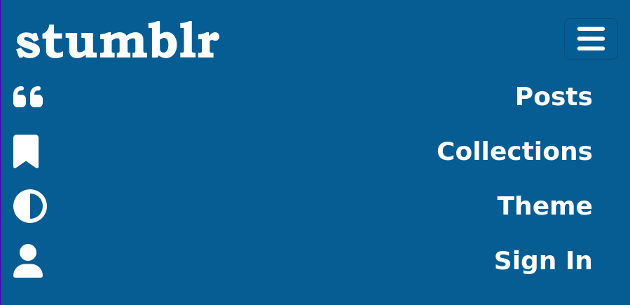
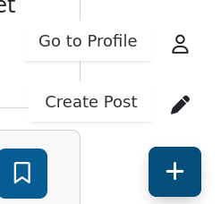
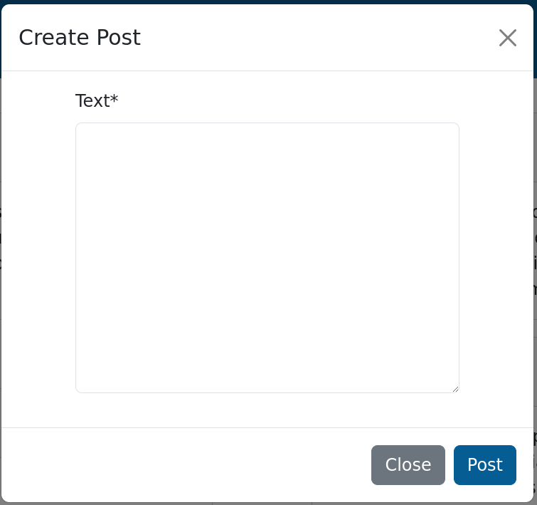
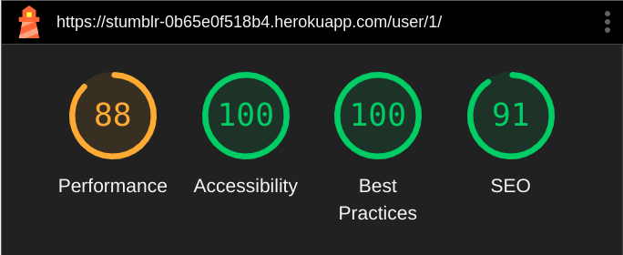

# Stubmlr

Stumblr is a website created to allow users to share and reblog posts, organise them into collections and follow each other to receive updates when users they are interested in post.

The main objective of the site is to allow users to interact on the platform through microblogging. This is achieved by providing a platform for publishing rich text posts, which can be searched, reblogged to be used as a basis for another post, and organised into collections.

Visit the deployed website [here](https://stumblr-0b65e0f518b4.herokuapp.com/).

## Table of Contents

- [Stubmlr](#stubmlr)
   * [Table of Contents](#table-of-contents)
   * [User Experience (UX)](#user-experience-ux)
      + [Strategy](#strategy)
         - [Project Goals](#project-goals)
         - [User Goals](#user-goals)
         - [Strategy Table](#strategy-table)
      + [Scope](#scope)
         - [User Stories](#user-stories)
      + [Structure](#structure)
         - [Database Model](#database-model)
      + [Skeleton](#skeleton)
         - [Wireframes](#wireframes)
      + [Design](#design)
         - [Color Scheme](#color-scheme)
         - [Typography](#typography)
   * [Features](#features)
      + [All Pages](#all-pages)
      + [Post Lists](#post-lists)
         - [Other People's Posts](#other-peoples-posts)
         - [Own Posts](#own-posts)
      + [Collection List](#collection-list)
      + [Single Collection](#single-collection)
      + [User Profile](#user-profile)
      + [Authentication](#authentication)
   * [Technologies Used](#technologies-used)
      + [Languages Used](#languages-used)
      + [Libraries and Frameworks](#libraries-and-frameworks)
      + [Packages / Dependecies Installed](#packages-dependecies-installed)
      + [Database Management](#database-management)
      + [Tools and Programs](#tools-and-programs)
   * [Testing](#testing)
      + [Testing User Stories](#testing-user-stories)
      + [Code Validation](#code-validation)
         - [HTML](#html)
         - [CSS](#css)
         - [Python](#python)
         - [JavaScript](#javascript)
      + [Accessibility](#accessibility)
         - [Lighthouse Reports](#lighthouse-reports)
      + [Manual Testing](#manual-testing)
         - [Browser Compatibility](#browser-compatibility)
         - [Functionality Tests](#functionality-tests)
            * [All Pages](#all-pages-1)
            * [Post Lists](#post-lists-1)
            * [Collection List](#collection-list-1)
            * [Single Collection](#single-collection-1)
            * [User Profile](#user-profile-1)
            * [Authentication](#authentication-1)
         - [Failed Tests and Known Bugs](#failed-tests-and-known-bugs)
   * [Deployment](#deployment)
      + [Deploying on Heroku](#deploying-on-heroku)
   * [Finished Product](#finished-product)
   * [Credits](#credits)
      + [Content](#content)
      + [Code](#code)
   * [Acknowledgements](#acknowledgements)

---

## User Experience (UX)

### Strategy

#### Project Goals

- The website contains a slightly modified bootstrap theme that does not distract from the content and should be relatively familiar to most users

- Responsive design to make the website accessible on different screen sizes.

- Easy to navigate and interact with, with minimal need for page reloads to take actions

- Users are able to create an account in order to interact with the content.

- Logged-in users can post, create collections, add posts to the collections, etc.

#### User Goals

- As a Site Admin, I want to manage the site content.

- As a Site User, I want the information to be easy to find and read.

- As a Site User, I want to be able to create an account.

- As a Site User, I can create new posts and collections.

- As a Site User, I want to manage the content I created.

#### Strategy Table

| Feature                             | Importance | Difficulty |
| ----------------------------------- | ---------- | ---------- |
| Responsive design                   | 5          | 1          |
| Account registration                | 5          | 1          |
| Create, edit and delete posts       | 5          | 2          |
| Create, edit and delete collections | 5          | 2          |
| Follow users                        | 4          | 2          |
| Reblog posts                        | 4          | 3          |
| Add collection image                | 4          | 3          |
| Infinite scroll                     | 3          | 2          |
| Search for content                  | 4          | 4          |
| Add profile picture                 | 3          | 3          |
| Social media signup                 | 2          | 4          |
| **Total**                           | **44**     | **27**     |

### Scope

Since the features listed above have too high a difficulty score to be completed at once, I have divided them into three phases planned to approximately correspond to the three weeks set aside for the project. In each phase after the first, any feature that could not be completed would either be axed entirely or moved to the next phase at the expense of another feature with equal or higher estimated difficulty.

Due to time constraints and personal issues, I was only able to put in two weeks and all of the planned features in the Third Phase had to be axed.

**First Phase** (Importance: 20, Difficulty: 6)

- Responsive design (completed Week 1)
- Account registration (completed Week 1)
- Create, edit and delete posts (completed Week 1)
- Create, edit and delete collections (completed Week 1)

**Second Phase** (Importance: 15, Difficulty: 10)

- Follow users (completed Week 2)
- Reblog posts (axed)
- Add collection image (axed)
- Infinite scroll (completed Week 2)

**Third Phase** (Importance: 9, Difficulty: 11)

- Search for content (axed)
- Add profile picture (axed)
- Social media signup (axed)

#### User Stories

GitHub projects was used as my project management tool to track user stories. I also tracked bugs that I was not able to resolve straight away.

**Week 1**

**Week 2**

### Structure

- Header, footer and navigation bar are consistent on all pages.

- The opportunity to add additional content to the website is provided for the site user once they register an account via a floating action menu as well as contextual buttons.

- A 404-error page is available.

#### Database Model

The database model has been designed using [mermaid](https://mermaid.js.org/). The type of database being used for the is relational database being managed using [PostgreSQL](https://www.postgresql.org/).

Due to time constraints, some aspects of the model were simplified in the final project.

**User Model**

The User model is taken from the default Django model used for users.

**Follower Model**

- followed: The User being followed stored as a foreign key.

- follows: The User following the followed stored as a foreign key.

**Post Model**

- text: The text of the post. Max 10000 characters.

- author: The user that authored the post stored as a foreign key.

- reblog: A self-referencing foreign key used for reblogging posts.

- time: The time when the post was posted.

**Collection_Post Model**

This model is obscured by how Django deals with many-to-many relationships. There is an intermediary model in the background that allows multiple posts to be associated with multiple collections.

- post: The post associated with a given collection.

- collection: The Collection associated with a given post.

**Collection Model**

- name: The name of the collection.

- description: The description of the collection.

### Skeleton

#### Wireframes

[Balsamiq](https://balsamiq.com/) has been used to create the mockups for the website.

| Page                    | Desktop Version                                                                                                      | Mobile Version                                                                                                     |
| ----------------------- | -------------------------------------------------------------------------------------------------------------------- | ------------------------------------------------------------------------------------------------------------------ |
| Index / User Logged Out |                                         |                                         |
| Log In                  |                                |                                |
| Log In Email Recognized |  |  |
| Collections Overview    |                       |                       |
| Single Collection       |                  |                  |
| User Profile            |                            |                            |

### Design

#### Color Scheme

The default Boostrap color scheme was used for the most part. Bootstrap was recompiled with a different underlying colorscheme though, to achieve the slightly darker and less pastel blue used for the site. The base color was Lapis Lazuli (#065D93) generated using Coolors and chosen to fit well with approximations of other values in the Bootstrap theme.

#### Typography

The default Bootstrap fonts were used.

[Back to top ⇧](#stumblr)

## Features

### All Pages

- Navbar at the top

  - Link to the index page with posts
  - Link to the collections page
  - Button to switch between light and dark theme
  - Log Out button displayed if user is logged in, leads the user to sign out form
    
  - Sign In button displayed if user is not logged in, leads the user to sign in form
    
  - Nav menu collapses into hamburger menu on smaller breakpoints
    
    

- Action Menu

  - Displayed only when user is logged in
  - Hovers in fixed position in the lower right corner of the screen
    
  - Hovering over it reveals actions available on all pages (Create Post or Go to Profile)
    
  - Clicking on Create Post opens a modal with the create post form
    
  - Once the user submits the form, the post is created: If the user is on a page containing a post list, the post is added, if not, a link to the main page where the post can be seen is shown in a toast
    

- Errors and Info
  - Error messages and info about action taken appear in toasts in the lower left corner
    

### Post Lists

- Post lists are displayed on the index page, on the individual collection page and on the user page
- The features are identical on all these pages

#### Other People's Posts

- If the user is not logged in, they only see the post with the text, date, and link to the user who authored it
  
- If the user is logged in, they also see a button allowing them to add the post to a collection they created
  
- If the user clicks on the button, a list of the collections they created is displayed
  
- If the user selects a collection, the post is added to the collection once they click away to close the menu
- If the user clicks on the pen icon next to a collection, the name is replaced with an input element, where they can enter the collection's new name and, after they press enter, the name is updated in the list and the backend
  
- If the user clicks on the plus at the bottom, they can add another collection straight from the menu
  

#### Own Posts

- The user's own posts have all the same features as other people's posts, plus the option to edit or delete
- The user sees additional two buttons in the upper right corner of posts they authored
  
- Clicking on the edit button opens the create post form in the modal with the prepopulated post text
- Submitting the form changes the text of the post
- Clicking on the delete button populates the modal with the delete form, showing the post to be deleted
  
- Clicking on Delete in the modal removes the post and shows a success message in the lower left corner
- The post list support infinite scroll: 16 posts are loaded initially and if the user scrolls beyond the loaded posts and there are additional posts to display, they are added to the page dynamically

### Collection List

- The collection list displays a list of collections
- Each collection also functions as a link to the individual collection page
  
- If the user is logged in and author of the collection, they also see the option to delete it
  
- Clicking on delete displays the modal asking the user to confirm the deletion, if they do, the collection is deleted
  
- Collection lists also support infinite scroll

### Single Collection

- The collection title and info is displayed, as well as all the posts added to the collection
- All the actions can be done upon the posts same as in any other post list

### User Profile

- The posts and collections created by the user are listed
- The top card also includes a list of followers and users the user whose profile is viewed follows
- If the user is logged in, they also see a Follow or Unfollow button they can use to follow or unfollow the viewed user respectively
  

### Authentication

- The log in, sign out and sign up pages were taken over from `allauth` and have only been styled to align with the rest of the site.

[Back to top ⇧](#stumblr)

## Technologies Used

### Languages Used

- [HTML5](https://en.wikipedia.org/wiki/HTML)
- [CSS3](https://en.wikipedia.org/wiki/CSS)
- [JavaScript](https://en.wikipedia.org/wiki/JavaScript)
- [Python](<https://en.wikipedia.org/wiki/Python_(programming_language)>)

### Libraries and Frameworks

- [Django](https://www.djangoproject.com/)
- [Bootstrap 5.3](https://getbootstrap.com/)
- [Font Awesome](https://fontawesome.com)
- [jQuery 3.6.0](https://jquery.com/)
- [Floating UI](https://floating-ui.com/)
- [js-cookie](https://github.com/js-cookie/js-cookie)

### Packages / Dependecies Installed

- [Django Allauth](https://django-allauth.readthedocs.io/en/latest/)
- [Django Crispy Form](https://django-crispy-forms.readthedocs.io/en/latest/)
- [Gunicorn](https://gunicorn.org/)

### Database Management

- [Postgres](https://www.postgresql.org/)

### Tools and Programs

- [Git](https://git-scm.com)
- [GitHub](https://github.com)
- [Heroku](https://www.heroku.com)
- [Am I Responsive](ami.responsivedesign.is)
- [Coolors](https://coolors.co)
- [Balsamiq](https://balsamiq.com/)
- [W3C Markup Validator](https://validator.w3.org/)
- [W3C CSS Validator](https://jigsaw.w3.org/css-validator/)
- [JSHint](https://jshint.com/)
- [Mockaroo](https://www.mockaroo.com/)

[Back to top ⇧](#stumblr)

## Testing

### Testing User Stories

#### 1. As a user I can view posts on the homepage so that I can read their content, as well as the content of any reblogs they refer to

- The reblog functionality has been removed due to insufficient time

- The user can view posts on the homepage

#### 1. As a user I can create an account so that I can later log in and post

- A sign in/sign up button is always displayed in the top right when the user is not logged in
- The button links to a sign in form with the option to sign up if the user does not have an account yet
- If the link to the sign up form is clicked, a sign up form is rendered
- If the user fills it out and submits it, a new profile is created for them with the data they entered and they are automatically logged in

#### 1. As a user I can log in to the site so that I can take actions on the site which are associated with my user profile

- A sign in/sign up button is always displayed in the top right when the user is not logged in
- If the user fills out the sign in form with the correct data and submit it, they are logged in

#### 1. As a user I can create and publish a post so that it is added to the site and displayed on the home page

- Signed-in users can create a post using the action menu in the bottom right

#### 1. As a user I can stay on the post page after posting without reloading so that I do not need to wait for the page to re-render anytime I post

- A post is added dynamically to a page with JS without a reload
- If there is no post list on the page, a notification instead informs the user the post was created successfully and links to the homepage, where the post can be seen

#### 1. As a user I can delete posts I have posted so that I can remove any content I no longer want to be up on the platform

- A button to delete a post is shown on the post if the user is logged in and has created the post
- Clicking on the button shows the post to be deleted in the modal and asks the user to confirm the deletion
- If the user confirms, the post is removed

#### 1. As a logged in user I can edit the posts I created so that I can change their content after posting

- A button to edit a post is shown on the post if the user is logged in and has created the post
- Clicking on the button prepopulates the form for editing and creating posts in the modal and gives the user the opportunity to edit the text of the post
- When the user submits the form, the text of the post is updated

#### 1. As a user I can create a collection so that I can later organise posts by common features

- A button to add a post to a collection is shown next to every post
- If the user clicks it, they see a list of their collections
- At the bottom of the list is a plus button
- If the user clicks it, they can enter the name of their new collection and create it by pressing enter

#### 1. As a user I can add a post to the collection I created so that I can organise posts I like by theme or common features

- A button to add a post to a collection is shown next to every post
- If the user clicks it, they see a list of their collections
- If they click on a collection, the collection is darkened to show it is selected
- Once they click away, the new set of collections is sent to the server and the associated collections of the post are updated

#### 1. As a logged-in user I can edit the name of collections I created so that I can change their designations if needed

- A button to add a post to a collection is shown next to every post
- If the user clicks it, they see a list of their collections
- There is a button with a pen icon next to every collection that allows the user to edit the collection name

#### 1. As a user I can view collections on a separate page so that I can navigate through the groupings of posts I created

- There is a collections page, where the user can view the list of all collections

#### 1. As a user I can view the posts that have been added to a collection so that I can navigate them by common features

- If a user clicks on a collection in the collections list, they see all the posts included in that collection

#### 1. As a user I can keep scrolling through posts and collections so that I do not need to switch pages when I get to the end of the loaded content

- Post, collection and user profile pages load an initial number of posts and collections (16)
- If the user keeps scrolling, additional posts and collections get loaded onto the page

#### 1. As a logged-in user I can follow another user so that I can filter my post view to only the people I follow

- The user sees a Follow button next to users on their profile page
- Clicking the button follows the user
- The filtering functionality has been cut due to lack of time

#### 1. As a logged-in user I can view which other users are following me so that I can figure out who is reading what I write

- Followers are listed on each user's profile page

#### 1. As a logged-in user I can view all users I follow so that I can get an overview of all of my preferred posters

- Followed users are listed on each user's profile page

#### 1. As a logged-in user I can unfollow another user so that they are no longer included in my preferred posters

- If a user already follows another user, they see an Unfollow button next to their username on the user profile page
- Clicking the button unfollows the user

### Code Validation

#### HTML

The [W3C Markup Validator](https://validator.w3.org/) was used to validate the HTML code of the project in order to ensure there were no syntax errors.

There was initially an error indicating that a `div` element was the child of an `h2` element in an impermissible fashion, resulting from the way the collection template was structured. The offending `h2` has been changed to `div`. (See commit 270ab4b13121273ad0138073339c16e70072d62c)

The `id` for the main content `div` was unset on the user porifle page due to a templating error. This has been corrected by adding an additional block to the `user.html` template. (See commit 629fa2befa7ce0c5503d8b294006d668bd54ff48)

There is still a warning on the index page that the language should be set to `zxx` or similar due to the Lorem Ipsum content. I have elected to ignore this warning, as the content is only illustrative and any posts made by human users will be in English, as are all the links and fixed content on the page.

#### CSS

I used the [W3C CSS Validator](https://jigsaw.w3.org/css-validator/) to validate my CSS.

No errors were found.

#### Python

The [autopep8 extension in VS Code](https://marketplace.visualstudio.com/items?itemName=ms-python.autopep8) was used to autoformat the code on save during development.

[PEP8 online](http://pep8online.com/) was further used to check the code. It indicated several overlong lines which were shortened in the following commits:

- a33ff6d801808d0850787dd7301a1dcd0ab6ba4e
- 89b25b2a97359ead5e3a99f0421ffdb797580bee
- 291fe16339f7e5de62dd68e15674c9be765f2231

#### JavaScript

[JSHints JavaScript Code Quality Tool](https://jshint.com/) was used to validate the JS code.

Several features were flagged as being support only in es9 (object spread) or es11 (optional chaining). Lines featuring these were removed and equivalent functionality achieved with more verbose code. JSHint also complained about how a ternary was formatted, so the position of the newline was adjusted. (See commit 4b74eef02b47b7a9e502e6caec82731246d21775)

### Accessibility

Lighthouse in Chrome DevTools has been used to confirm that the colors and fonts being used throughout the website are easy to read and accessible.

The only remaining Accessibility issue is the missing text in the action button. Lighthouse does not detect it, even though it is inside the span and readable to a screenreader.

See reports in the table below:

#### Lighthouse Reports

| Page              | Lighthouse Report                                                                         |
| ----------------- | ----------------------------------------------------------------------------------------- |
| Home              |                     |
| Collections       |       |
| Single Collection |  |
| User Profile      |             |
| Log Out           |               |
| Log In            |                 |
| Sign Up           |                |
| 404               |                       |

### Manual Testing

#### Browser Compatibility

| Browser         | Outcome                                                 | Pass/Fail |
| --------------- | ------------------------------------------------------- | --------- |
| Google Chrome   | No appearance, responsiveness nor functionality issues. | Pass      |
| Mozilla Firefox | No appearance, responsiveness nor functionality issues. | Pass      |
| Microsoft Edge  | No appearance, responsiveness nor functionality issues. | Pass      |

#### Functionality Tests

##### All Pages

| Test                                                                | Pass/Fail |
| ------------------------------------------------------------------- | --------- |
| Nav displayed correctly on all breakpoints, without overflow        | Pass      |
| Nav collapses to hamburger on smaller breakpoints                   | Pass      |
| When the hamburger is clicked, the menu is opened                   | Pass      |
| Clicking on Posts leads the user to the homepage                    | Pass      |
| Clicking on Collections leads the user to the collections list page | Pass      |
| Clicking on Theme toggles the dark theme                            | Pass      |
| The theme persists across a session                                 | Pass      |
| If the user is not logged in, the Sign In button is shown           | Pass      |
| Clicking on the sign in button leads the user to the sign in form   | Pass      |
| If the user is logged in, the Log Out button is shown               | Pass      |
| Clicking on the Log Out button leads the user to the Sign Out form  | Pass      |
| The action menu is displayed when the user is logged in             | Pass      |
| Hovering over the action menu displays both menu items              | Pass      |
| Clicking on Create Post opens the modal with the Create Post Form   | Pass      |
| Filling the modal and submitting the form creates a new post        | Pass      |
| If the user is on a page with a post list, the post is added        | Pass      |
| The post is not added to the post list on the user page             | Fail      |
| Clicking on Go to Profile takes the user to their own profile       | Pass      |

##### Post Lists

| Test                                                                                                                         | Pass/Fail |
| ---------------------------------------------------------------------------------------------------------------------------- | --------- |
| Posts are displayed correctly                                                                                                | Pass      |
| On user profile pages, only the user's posts are displayed                                                                   | Pass      |
| Clicking on the username leads the user to the post author's profile                                                         | Pass      |
| If the user is logged in, the option to add a post to the collection is displayed                                            | Pass      |
| If the user clicks on this button, a list of their collections is displayed                                                  | Pass      |
| If the user clicks on a collection, it is selected                                                                           | Pass      |
| If the user clicks away, the post is added and removed depending on selected options                                         | Pass      |
| If the user clicks on the pen next to the collection, the renaming form is shown                                             | Pass      |
| If the user enters a new name and presses enter, the collection is renames                                                   | Pass      |
| If the user clicks on the plus at the bottom of the menu, the create collection form is shown                                | Pass      |
| If the user enters a new name and presses enter, a new collection is created                                                 | Pass      |
| If the user creates a new collection on a page where their collection list is displayed, the collection is added to the list | Fail      |
| If the user clicks on the edit post button, the modal is shown with a prepopulated create post form                          | Pass      |
| If the user submits the form with new text, the post is updated                                                              | Pass      |
| If the user clicks on the delete post button, the modal is shown with the option to confirm deletion                         | Pass      |
| If deletion is confirmed, the post is deleted                                                                                | Pass      |
| If the user scrolls past the loaded posts, new posts are loaded and displayed                                                | Pass      |

##### Collection List

| Test                                                                                        | Pass/Fail |
| ------------------------------------------------------------------------------------------- | --------- |
| Collections are displayed correctly                                                         | Pass      |
| Clicking on a collection leads the user to the individual collection page                   | Pass      |
| Clicking on the username of the collection author leads the user to their profile           | Pass      |
| If the user is logged in and the author of the collection, they see the button to delete it | Pass      |
| Clicking on the delete button displays the delete form in the modal                         | Pass      |
| Confirming the deletion deletes the collection                                              | Pass      |
| Scrolling past the last loaded collection dynamically loads other collections               | Pass      |

##### Single Collection

| Test                                                                   | Pass/Fail |
| ---------------------------------------------------------------------- | --------- |
| The collection title is displayed correctly                            | Pass      |
| The posts are correctly filtered to only those added to the collection | Pass      |

##### User Profile

| Test                                                                                | Pass/Fail |
| ----------------------------------------------------------------------------------- | --------- |
| The username is displayed correctly                                                 | Pass      |
| The posts and collections are correctly filtered to only those authored by the user | Pass      |
| If the user is logged in, they see the option to follow or unfollow the user        | Pass      |
| Clicking the button updates the follow state and changes the button text            | Pass      |
| Followers and followed users are listed correctly                                   | Pass      |

##### Authentication

| Test                                                                            | Pass/Fail |
| ------------------------------------------------------------------------------- | --------- |
| Entering the correct username and password in signin sings the user in          | Pass      |
| Entering incorrect info returns an error                                        | Pass      |
| The link to the sign up form works                                              | Pass      |
| Entering data into the sign up form creates a user profile and logs the user in | Pass      |
| Clicking on the sign out button logs the user our                               | Pass      |

[Back to top ⇧](#stumblr)

#### Failed Tests and Known Bugs

- Creating a post on a page with a post list that should not contain the logged/in user's posts still adds the post to the post list. This is due to incorrect logic in the create post functionality in `main.js` that I was not able to fix due to time constraints.
- Creating a collection does not update the collection list, even if the user is on their own profile page, where both a list of their collections and a list of their posts is displayed

## Deployment

This project was developed using [VS Code](https://code.visualstudio.com/). The code was commited to [Git](https://git-scm.com/) and pushed to [GitHub](https://github.com/") using the terminal.

### Deploying on Heroku

To deploy this page to Heroku from its GitHub repository, the following steps were taken:

1. Create the Heroku App:

   - Select "Create new app" in Heroku.
   - Choose a name for your app and select the location.

2. Prepare the environment and settings.py file:

   - In the Settings tab, click on Reveal Config Vars and copy the url next to DATABASE_URL.
   - In your workspace, create an env.py file in the main directory.
   - Add the DATABASE_URL value and your chosen SECRET_KEY value to the env.py file.
   - Add the SECRET_KEY value to the Config Vars in Heroku.
   - Update the settings.py file to import the env file and add the SECRETKEY and DATABASE_URL file paths.
   - In settings.py add the following sections:
     - STATICFILE_STORAGE
     - STATICFILES_DIRS
     - STATIC_ROOT
     - TEMPLATES_DIR
     - Update DIRS in TEMPLATES with TEMPLATES_DIR
     - Update ALLOWED_HOSTS with ['127.0.0.1', '.herokuapp.com']

[Back to top ⇧](#stumblr)

## Finished Product

| Page              | Desktop                                                                                     | Mobile                                                                                    |
| ----------------- | ------------------------------------------------------------------------------------------- | ----------------------------------------------------------------------------------------- |
| Home              |                        |                        |
| Collections       |              |              |
| Single Collection |  |  |
| User Profile      |                    |                    |
| Log Out           |                       |                       |
| Log In            |                        |                        |
| Sign Up           |                       |                       |
| 404               |                              |                              |

[Back to top ⇧](#stumblr)

## Credits

### Content

- The content has been generated using [Mockaroo](https://www.mockaroo.com/).

### Code

- The HTML, CSS and JS for the floating action button have been taken from [Propeller](https://opensource.propeller.in/components/floating-button).

[Back to top ⇧](#stumblr)

## Acknowledgements

- Marta, for tolerating my often changing, inconsistent and time-consuming life and career plans.

- My family, for their useful feedback and inevitable joshing.

- My tutor, Marcel, for his patience, notes, feedback, encouragement and clear, precise pointers on what to focus on in moments of total disorientation.

- Code Institute for teaching me what I needed to know to make this website.

[Back to top ⇧](#stumblr)
